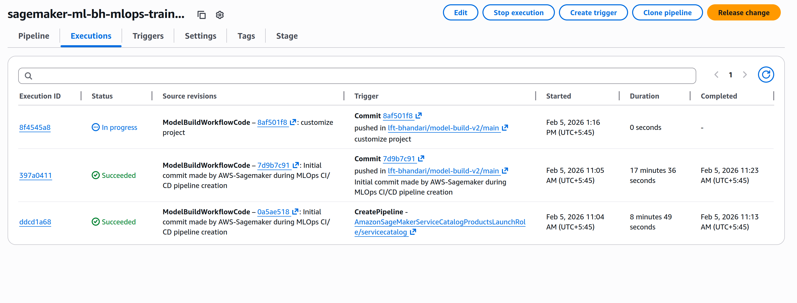
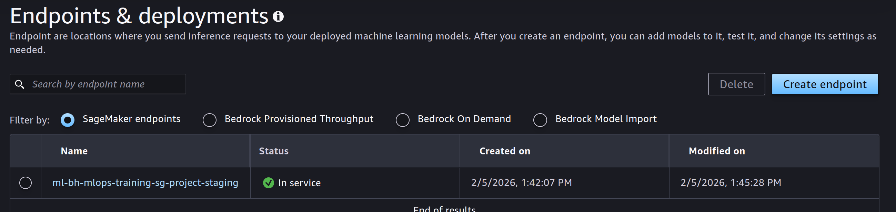
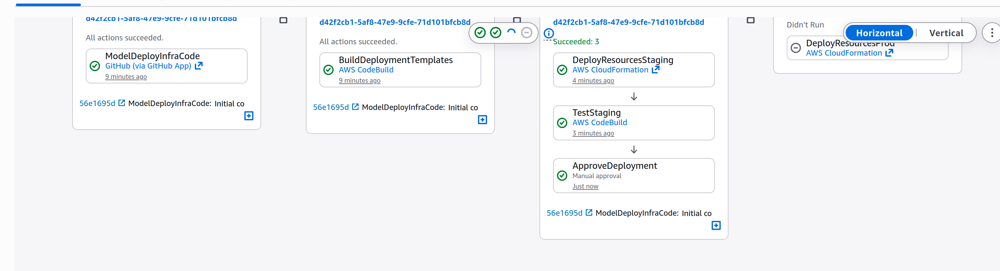

## Notebook 0- Start Here

In the first notebook, we basically setup the necessary packages and dependencies for successfully running the upcoming notebooks.
We also setup some important constants like region, session and dataset that will be used throughout the workshop or tutorial.

One of the main dependency was setting up the MLFlow app server that would help in organizing the ML experiments.
It also guided us to upload the data into S3 bucket.

## Notebook 1 - Idea development
This notebook was all about experimentation. Loading data, performing EDA, some feature engineering, ML hyperparameter tuning with cross validation and logging all the experimentation results, artifacts into ML flow app.

## Notebook 2 - Sagemaker Containers
This notebook was about running training jobs. Training script was created locally on the jupyter labspace and ran remotely as a Sagemaker job. It also included short intrduction on how can we run the sagemaker jobs as a docker container.

## Notebook 3 - Add an ML pipeline
This notebook was all about creating a pipeline for streamlining the fundamental workflows practiced in ML development cycle 
which included data preprocessing, data transformation, model training, experimentation and model evaluation.
AWS Pipelines was used to orchestrate the different steps.

## Notebook 4 -

In this notebook we implemented a CI/CD pipeline with the following features:

1. A model building ML pipeline which is under the source control in a GitHub repository
2. Every push into the code repository launched a new CodePipeline pipiline which constructed, upsert, and executed the ML pipeline
3. The whole end to end model development process is automated
SageMaker project is a logical construct in Studio which has the metadata about related ML pipelines, repositories, models, experiments, and inference endpoints

CI/CD Execution Pipeline

**Repositories Links:**
* [Model Build Github Repo](https://github.com/lft-bhandari/model-deploy-v2/tree/main)
* [Model Deploy Github Repo](https://github.com/lft-bhandari/model-build-v2/tree/main)

## Notebook 5 -

Deployment Endpoint

Manual Approval

In this notebook we implemented an automated CI/CD deployment pipeline with the following features:

    use CloudFormation templates for SageMaker real-time inference endpoint deployment
    model approval in the model registry launches the model deployment pipeline
    model deployment pipeline contains two stages, staging and production with automated tests for the staging endpoint and manual approval for the production deployment, and final deployment of the production endpoint.

## Notebook 6 -
In this notebook we are used Amazon SageMaker model monitor to add continuous and automated monitoring of the data quality for the traffic to your real-time SageMaker inference endpoints. We also implemented model monitoring to detect performance drift and model metric anomalies.

Using Model Monitor integration with Amazon EventBridge we can implement automated response and remediation to any detected issues with data and model quality. 

Additionally to data and model quality monitoring you can implement bias drift and feature attribution drift monitoring.

## Notebook 7 -

Clean up notebook.